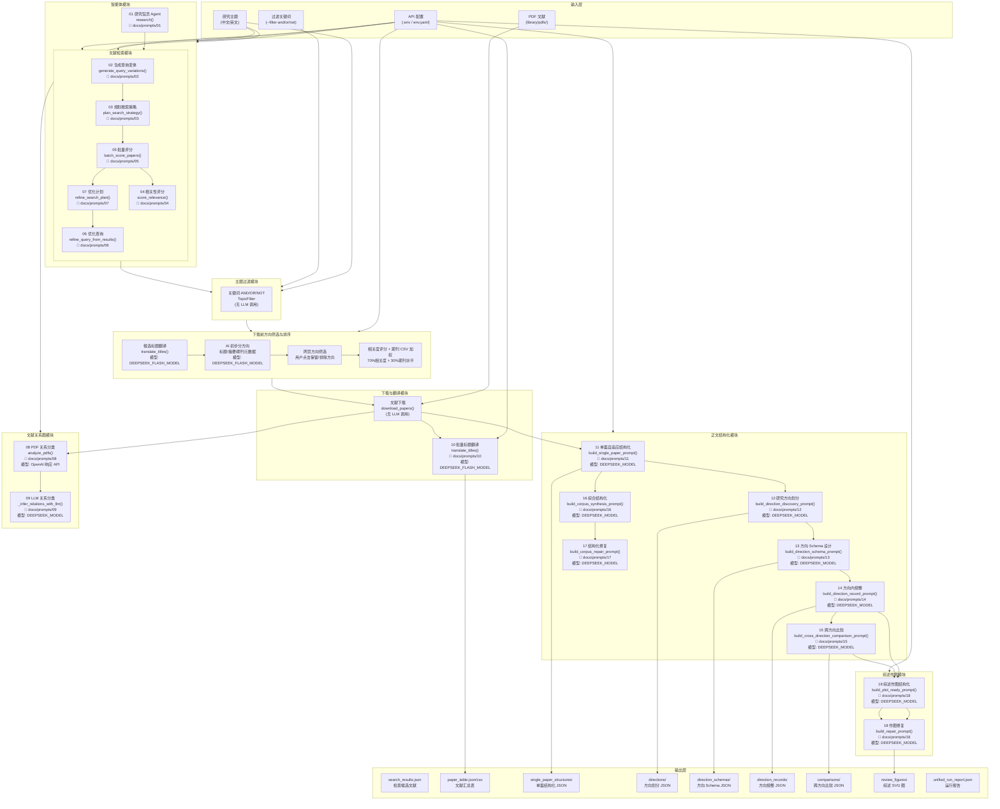

# Literature Agent — AI 调用流程图



## 数据流总览

```
用户输入主题
  │
  ├─ [智能体 Agent] → 调度工具 → 检索/下载/保存
  │
  ├─ [高级检索] → 查询生成 → 策略规划 → 评分 → 优化 → 检索结果 JSON
  │
  ├─ [主题过滤] → 关键词 AND/OR/NOT 筛选 → 过滤后论文列表
  │
  ├─ [下载前方向筛选] → 标题/摘要/期刊元数据分方向 → 用户保留/排除方向
  │
  ├─ [下载前排序] → 相关度 70% + 期刊 CSV 水平 30% → selected_candidates.json
  │
  ├─ [PDF 下载] → library/pdfs/
  │
  ├─ [标题翻译] → paper_table.json / paper_table.csv
  │
  ├─ [PDF 正文结构化]
  │   ├─ 单篇结构化 → single_paper_structures/
  │   ├─ 方向划分   → directions/
  │   ├─ Schema     → direction_schemas/
  │   ├─ 规整       → direction_records/
  │   └─ 跨方向比较 → comparisons/
  │
  ├─ [综述作图] → 中文结构化 → 修复 → review_figures/*.svg
  │
  └─ [文献关系图] → PDF 分析 → LLM 关系分类 → 文献图谱
```

## Prompt 文件索引

| # | 文件 | 模块 | 模型 | 角色 |
|---|------|------|------|------|
| 01 | `01-agent-system.txt` | 智能体 | 默认 | system |
| 02 | `02-generate-query-variations.txt` | 高级检索 | 默认 | user |
| 03 | `03-plan-search-strategy.txt` | 高级检索 | 默认 | user |
| 04 | `04-score-relevance.txt` | 高级检索 | 默认 | user |
| 05 | `05-batch-score-papers.txt` | 高级检索 | 默认 | user |
| 06 | `06-refine-query.txt` | 高级检索 | 默认 | user |
| 07 | `07-refine-search-plan.txt` | 高级检索 | 默认 | user |
| 08 | `08-pdf-relation-classify.txt` | 关系图 | OpenAI 响应API | user |
| 09 | `09-llm-relation-classify.txt` | 关系图 | 默认 | system+user |
| 10 | `10-batch-title-translation.txt` | 翻译 | **FLASH** | system+user |
| 10A | `10A-download-prescreen.txt` | 预筛 | **FLASH** | system+user |
| 11 | `11-single-paper-structure.txt` | 结构化 | 默认 | user |
| 12 | `12-direction-discovery.txt` | 结构化 | 默认 | user |
| 13 | `13-direction-schema.txt` | 结构化 | 默认 | user |
| 14 | `14-direction-record.txt` | 结构化 | 默认 | user |
| 15 | `15-cross-direction-comparison.txt` | 结构化 | 默认 | user |
| 16 | `16-corpus-synthesis.txt` | 结构化 | 默认 | user |
| 17 | `17-corpus-repair.txt` | 结构化 | 默认 | user |
| 18 | `18-plot-ready-structure.txt` | 作图 | 默认 | user |

> **模型说明**：`默认` = DEEPSEEK_MODEL (deepseek-v4-pro)；`FLASH` = DEEPSEEK_FLASH_MODEL (deepseek-v4-flash)
