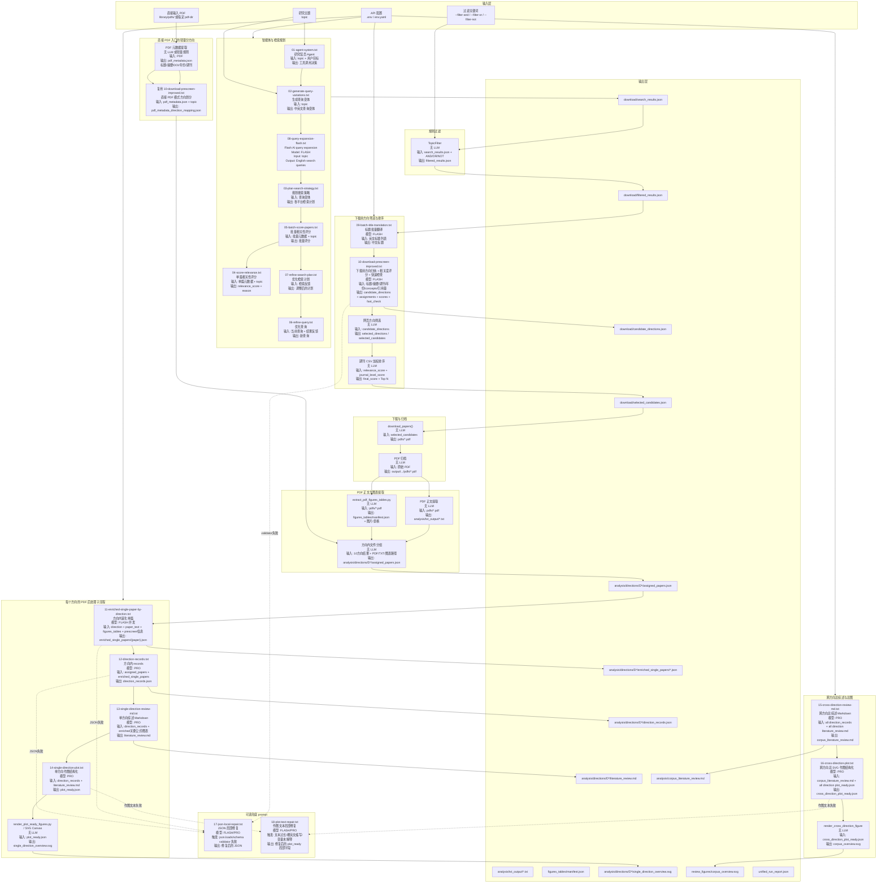

# Literature Agent 新版 AI 调用流程图

> 目标：在保留现有检索、过滤、下载、PDF 正文提取、图表提取和 SVG 渲染能力的基础上，重构“得到 PDF 后”的文献研究流程。核心原则是：**方向划分前移到下载前 10；PDF 全文不再用于重复分方向；方向确定后，再做方向内富化、方向综述、方向图和总综述图。**

---

## 1. 总体流程图



---

## 2. 两种入口的数据流

### 2.1 从检索开始

```text
研究主题
  ↓
01-08 检索与查询优化 prompts
  ↓
search_results.json
  ↓
TopicFilter 规则过滤
  ↓
filtered_results.json
  ↓
10 标题翻译 + 10 下载前方向筛选
  ↓
candidate_directions.json / scored_candidates.json
  ↓
用户保留/排除方向
  ↓
selected_candidates.json
  ↓
下载 PDF
  ↓
PDF 正文 TXT + 图表 manifest
  ↓
按 10 方向结果组织方向目录
  ↓
11 → 12 → 13 → 14 方向内处理
  ↓
15 → 16 跨方向总综述与总图
```

### 2.2 直接从 PDF 开始

```text
已有 PDF
  ↓
提取 PDF 元数据：标题 / 摘要 / DOI / 年份 / 期刊
  ↓
复用 10 做轻量方向划分
  ↓
pdf_metadata_direction_mapping.json
  ↓
可选：用户保留/排除方向
  ↓
PDF 正文 TXT + 图表 manifest
  ↓
按 10 方向结果组织方向目录
  ↓
11 → 12 → 13 → 14 方向内处理
  ↓
15 → 16 跨方向总综述与总图
```

---

## 3. Prompt 输入输出总表

| 编号 | Prompt 文件 | 是否默认调用 | 模型建议 | 输入 | 输出 | 后续使用 |
|---|---|---:|---|---|---|---|
| 01 | `01-agent-system.txt` | 是 | 默认/PRO | 用户研究主题、工具上下文 | 工具调用决策 | 触发检索/下载 |
| 02 | `02-generate-query-variations.txt` | 是 | PRO | 研究主题 | 中英文查询变体 | 03 |
| 03 | `03-plan-search-strategy.txt` | 是 | PRO | 查询变体 | 多平台检索策略 | 检索模块 |
| 04 | `04-score-relevance.txt` | 可选 | PRO | 单篇标题/摘要/concepts/期刊 + topic | 单篇相关性评分 | 检索排序或调试 |
| 05 | `05-batch-score-papers.txt` | 是 | PRO | 批量元数据 + topic | 批量相关性评分 | 预筛前参考 |
| 06 | `06-refine-query.txt` | 可选 | PRO | 当前查询 + 检索反馈 | 优化后的查询 | 下一轮检索 |
| 07 | `07-refine-search-plan.txt` | 可选 | PRO | 当前计划 + 平台效果反馈 | 调整后的搜索计划 | 下一轮检索 |
| 08 | `08-query-expansion-flash.txt` | yes | FLASH | topic | English search queries | OpenAlex / arXiv / IEEE search |
| 09 | `09-batch-title-translation.txt` | 是 | FLASH | 英文标题列表 | 中文标题 | paper_table / 10 |
| 10 | `10-download-prescreen-improved.txt` | 是 | FLASH | 标题、摘要、期刊、年份、concepts、引用量、topic | 方向归纳、唯一分配、相关度评分、fast_check | 下载前用户筛选；直接 PDF 轻量分方向 |
| 11 | `11-enriched-single-paper-by-direction.txt` | 是 | FLASH 并发 | 方向信息、单篇全文 TXT、图表清单、预筛理由 | 方向内富化单篇 JSON | 12、13 |
| 12 | `12-direction-records.txt` | 是 | PRO | assigned_papers + enriched JSON | direction_records.json | 13、14、15 |
| 13 | `13-single-direction-review-md.txt` | 是 | PRO | direction_records + 关键公式/图表 | 单方向 `literature_review.md` | 14、15 |
| 14 | `14-single-direction-plot.txt` | 是 | PRO | direction_records + literature_review.md | 单方向 `plot_ready.json` | SVG 渲染 |
| 15 | `15-cross-direction-review-md.txt` | 是 | PRO | 全部 direction_records + 全部单方向 review.md | `corpus_literature_review.md` | 16 |
| 16 | `16-cross-direction-plot.txt` | 是 | PRO | corpus review + 全部方向 plot_ready.json | `cross_direction_plot_ready.json` | 总 SVG 渲染 |
| 17 | `17-json-local-repair.txt` | 失败时 | FLASH/PRO | 原始输出、错误信息、目标 schema | 修复后的 JSON | 继续 pipeline |
| 18 | `18-plot-text-repair.txt` | 失败时 | FLASH/PRO | plot_ready 局部字段、文本错误信息 | 修复后的作图文本字段 | SVG 渲染 |

---

## 4. 中间文件输入输出关系

### 4.1 下载前方向筛选输出

```text
输入:
  filtered_results.json
  paper_table.json
  topic

Prompt:
  10-download-prescreen-improved.txt

输出:
  download/candidate_directions.json
  download/scored_candidates.json
  download/screening_state.json
  download/selected_candidates.json
```

### 4.2 方向内文件分组输出

```text
输入:
  selected_candidates.json
  candidate_directions.json
  selected_source_pdfs.json
  analysis/txt_output/*.txt
  figures_tables/manifest.json

无 LLM:
  build_direction_workspace()

输出:
  analysis/directions/D1/assigned_papers.json
  analysis/directions/D2/assigned_papers.json
  ...
```

### 4.3 方向内富化单篇输出

```text
输入:
  analysis/directions/D*/assigned_papers.json
  analysis/txt_output/{paper}.txt
  figures_tables/manifest.json

Prompt:
  11-enriched-single-paper-by-direction.txt

输出:
  analysis/directions/D*/enriched_single_papers/{paper_id}.json
```

### 4.4 方向 records 输出

```text
输入:
  analysis/directions/D*/assigned_papers.json
  analysis/directions/D*/enriched_single_papers/*.json

Prompt:
  12-direction-records.txt

输出:
  analysis/directions/D*/direction_records.json
```

### 4.5 单方向综述与图输出

```text
输入:
  analysis/directions/D*/direction_records.json
  analysis/directions/D*/enriched_single_papers/*.json

Prompt:
  13-single-direction-review-md.txt

输出:
  analysis/directions/D*/literature_review.md

继续输入:
  direction_records.json
  literature_review.md

Prompt:
  14-single-direction-plot.txt

输出:
  analysis/directions/D*/plot_ready.json
  analysis/directions/D*/single_direction_overview.svg
```

### 4.6 跨方向总综述与总图输出

```text
输入:
  analysis/directions/*/direction_records.json
  analysis/directions/*/literature_review.md

Prompt:
  15-cross-direction-review-md.txt

输出:
  analysis/corpus_literature_review.md

继续输入:
  analysis/corpus_literature_review.md
  analysis/directions/*/plot_ready.json

Prompt:
  16-cross-direction-plot.txt

输出:
  analysis/cross_direction_plot_ready.json
  review_figures/corpus_overview.svg
```

---

## 5. 不再默认调用的旧 prompt

| 旧编号 | 旧功能 | 新处理 |
|---|---|---|
| legacy-pdf-relation | PDF 关系分类 | 暂停默认调用，文献关系图以后再接 |
| legacy-llm-relation | LLM 关系分类 | 暂停默认调用，文献关系图以后再接 |
| 11 | 单篇自适应结构化 | 被新 11 方向内富化单篇替代 |
| 12 | PDF 后研究方向划分 | 移除默认流程；方向划分前移到 10 |
| 13 | 方向 Schema 设计 | 并入新 12 的 `comparison_axes` |
| 14 | 方向内规整 | 被新 12 方向 records 替代 |
| 15 | 跨方向比较 JSON | 被新 15 总综述 MD + 新 16 总图替代 |
| 16 | corpus_synthesis 四合一 | 删除默认调用，避免大而慢 |
| 17 | corpus repair | 替换为新 17 JSON 局部修复 |
| 18 | 传统综述作图结构化/修复 | 拆成新 14 单方向图、新 16 总图、新 18 作图文本修复 |
| 19 | 富化单篇结构化 | 改造成新 11，增加 direction 上下文 |
| 20 | 单方向文献综述 | 改造成新 13，并增加 direction_records 主输入 |
| 21 | 单方向作图 | 改造成新 14，并减少重复输出 |
