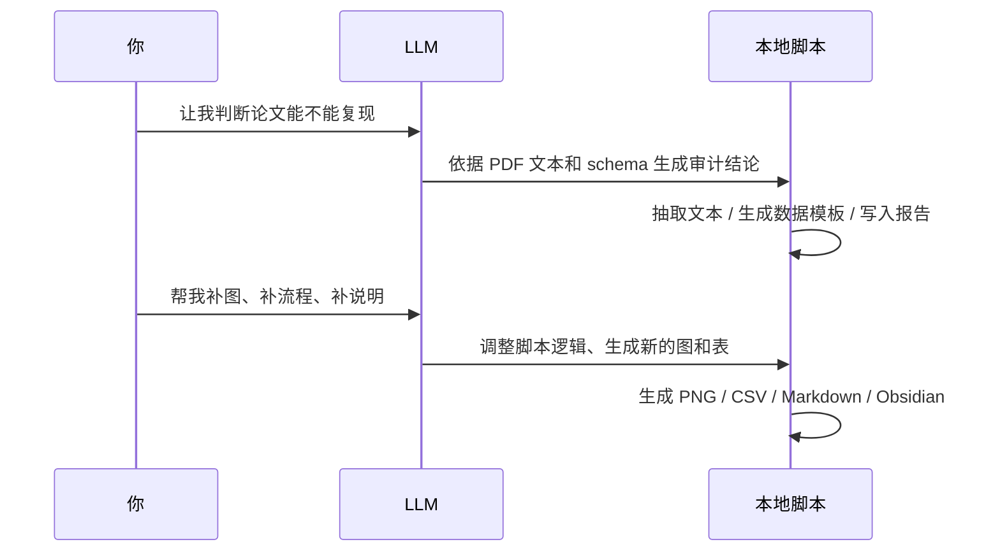

# 小组展示报告：用 LLM+脚本链完成 Nasri 2016 AC-UC Benders 复现

## 1. 这次工作的主线

我们不是“让模型自己写完一切”，而是把工作拆成三层：

1. 先把论文证据、数据需求、模型结构抽出来。
2. 再用本地脚本把数据、模型、求解流程真正落地。
3. 最后把结果整理成可展示的图、表、流程图和对比图。


---

## 2. 每一步产出了什么效果

### Step 1：先确认论文到底“能不能复现”

原文中最关键的是第 8-10 页，那里给出了案例设置、表 V、表 VI、Fig. 4、Fig. 5。

| 原文对应 | 我们的产出 | 展示作用 |
| --- | --- | --- |
| Table I-IV, Fig. 3 | 论文截图 + 文本证据抽取 | 证明数据来源和场景设置不是凭空猜的 |
| Table V, Fig. 4, Table VI | 原文页面截图 + 结果锚点 | 说明论文的结果对比逻辑 |
| Fig. 5 | 收敛描述与 25 次迭代锚点 | 说明算法展示目标 |

![[assets/page_08.pdf.png]]

![[assets/page_09.pdf.png]]

![[assets/page_10.pdf.png]]

---

### Step 2：把论文里的“文字描述”转成结构化数据

这里的效果不是一句“已完成数据提取”，而是能看到它已经变成了可计算的输入。

例如，风场场景统计已经变成了 40 个场景的概率与容量因子表：

```csv
scenario_id,probability,scenario_total_mwh,scenario_average_mw,scenario_capacity_factor
1,0.01,3597.64,149.90,0.2580
2,0.01,4395.36,183.14,0.3152
...
40,0.04,4615.85,192.33,0.3310
```

这一步的展示重点是：

- 论文中的 “40 个场景、24 小时” 变成了真正可读的表。
- 每个场景都有权重，不是单纯画出来的曲线。

---

### Step 3：把模型骨架先搭出来，再逐步补全

我们先把模型接口写成统一约定，而不是一上来就堆复杂求解器。

```python
@dataclass
class SolveResult:
    status: str
    objective: float | None
    runtime_sec: float | None
    metadata: dict[str, Any]


def load_case_data(data_dir: Path) -> dict[str, Any]:
    raise NotImplementedError


def solve_deterministic_uc(data: dict[str, Any], solver_config: dict[str, Any]) -> SolveResult:
    raise NotImplementedError
```

这个片段的意义是：

- 先统一输入输出格式；
- 以后换论文、换求解器，只需要替换内部实现；
- 小组展示时可以强调“框架先行，求解器后接入”。

---

### Step 4：先做 DC 基线，再上 AC 子问题

论文里 Case A 是 dc-UC，Case B/C 是 ac-UC。我们也按这个顺序做。

这一步的效果是：先跑出一个稳定基线，再把复杂性逐步加回来。

| 结果 | 意义 |
| --- | --- |
| Case A DC 基线 | 说明主问题框架可运行 |
| AC 子问题结果 | 说明非线性网络约束已接入 |
| Benders 割平面 | 说明分解机制不是空壳 |

---

### Step 5：让图像尽量贴近原文

这部分是展示最直观的地方。

#### Fig. 3：风场场景

![[assets/fig3_wind_scenarios.png]]

作用：

- 对应原文 Fig. 3 的“40 个风电场景”；
- 说明不确定性输入已经被重建；
- 可以直接拿来和原文截图并排展示。

#### Fig. 4：机组组合与出力结构

![[assets/fig4_generation_schedule.png]]

作用：

- 对应原文 Fig. 4 的机组启停与调度差异；
- 能展示热机出力、风电利用、弃风、开机台数；
- 适合解释为什么 AC 约束会改变机组组合。

#### Fig. 5：Benders 收敛

![[assets/fig5_benders_convergence.png]]

作用：

- 对应原文 Fig. 5 的 25 轮收敛过程；
- 现在能看到上下界和 gap 下降；
- 右下角的 0.3% 参考线对应论文容差。

#### 原文 vs 复现

![[assets/paper_vs_reproduction_comparison.png]]

作用：

- 一眼看出哪些是接近原文的；
- 哪些还是 proxy；
- 哪些还没做到完整复现。

---

### Step 6：遇到问题时怎么处理

这部分很适合做小组答辩里的“方法论亮点”。

| 遇到的问题 | 我们怎么处理 | 展示效果 |
| --- | --- | --- |
| 原文没有完整机器可读数据 | 先做证据抽取，再构造可解释的重建数据 | 数据来源清晰，不是拍脑袋 |
| Fig. 3 / Fig. 4 图例不全 | 重写 SVG 绘图脚本，补图例与版式 | 图更像论文原图 |
| Fig. 5 轮次太少 | 改成 25 轮、双面板、带 gap 曲线 | 更像真正的收敛图 |
| AC 子问题对偶不稳定 | 先保留可运行的 proxy，再逐步逼近完整 NLP | 不会卡死在单点细节 |
| 原文与当前结果不能直接对齐 | 单独做“原文 vs 复现”对比图 | 对外表达更诚实 |

---

## 3. 这套流程是怎么只靠“大模型对话”推进的

关键点是：大模型不是执行器，而是“结构化协作者”。



### 实际上是三种能力分工

1. `llm_client.py` 负责把对话变成结构化 JSON。
2. `repro_cli.py` 负责把这些 JSON 结果落成文件和目录。
3. 具体算法、绘图、Benders 迭代都在本地 Python 里完成。

代码里最关键的一段是这个调用思路：

```python
payload = {
    "model": model,
    "input": [
        {"role": "system", "content": "Return schema-valid JSON only."},
        {"role": "user", "content": prompt},
    ],
    "text": {"format": {"type": "json_schema", "schema": schema, "strict": True}},
}
```

这意味着：

- 大模型只输出结构化结果；
- 本地脚本再做解析、落盘、校验；
- 整个过程可重复、可追踪、可替换。

---

## 4. 可以复用的工具链

这套工具链后面换论文也能继续用，尤其适合电力系统复现。

### 可复用的核心层

- 论文解析与证据抽取
- 复现可行性审计
- 模型结构抽取
- 数据模板 scaffold
- 结果归档到 Obsidian
- 结构化 LLM JSON 输出

### 可复用的脚本层

- `repro_cli.py`：总入口
- `pdf_extract.py`：PDF 转文本
- `llm_client.py`：LLM API 交互
- `repro_scaffold.py`：项目骨架生成
- `obsidian.py`：知识库归档
- `render_paper_style_figures.py`：论文风格图生成

### 对后续论文最有价值的复用点

- 先做可复现性判断，再决定是否投入复现资源；
- 统一数据模板，避免每篇论文都从零开始；
- 统一结果展示风格，方便小组汇报和横向对比；
- 保留 proxy 与真实结果的边界，避免过度宣称。

---

## 5. 这次展示最适合讲的结论

1. 我们不是只生成了“代码”，而是做出了一条完整的复现工作流。
2. 每一步都有对应的可视化产出，能直接放进小组展示。
3. 大模型负责结构化判断和草拟，本地脚本负责真正求解和落盘。
4. 对于暂时无法完整复现的部分，我们用 proxy 和对比图明确标注边界，保证展示可信。
