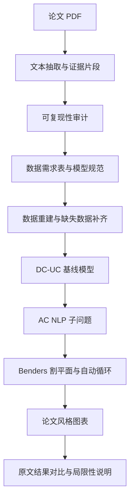
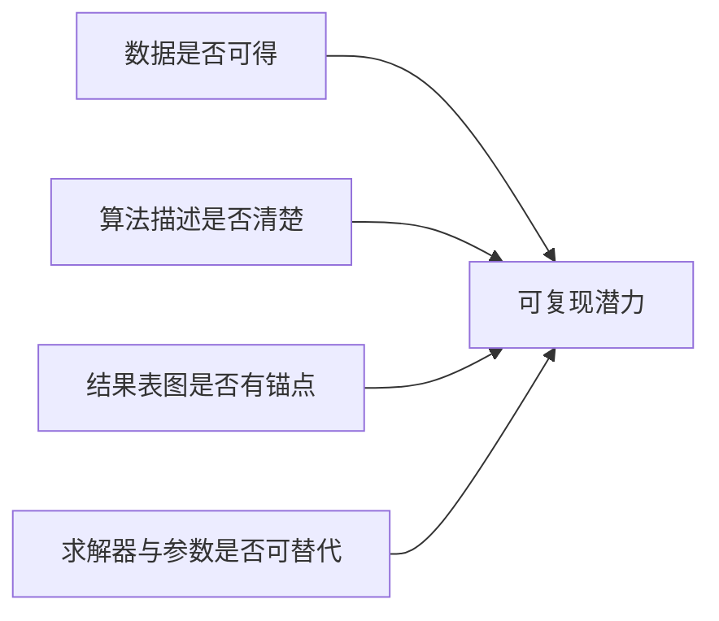
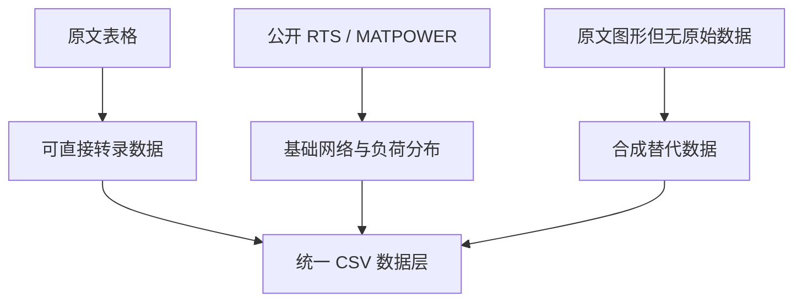
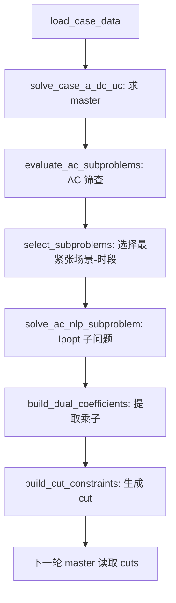
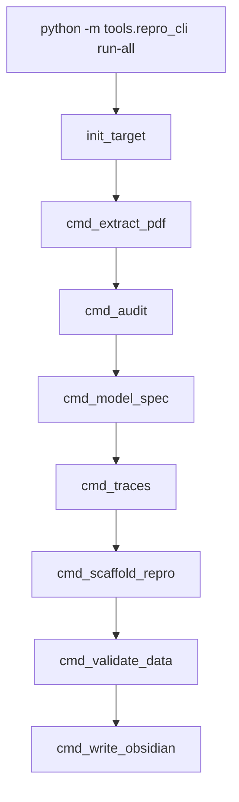
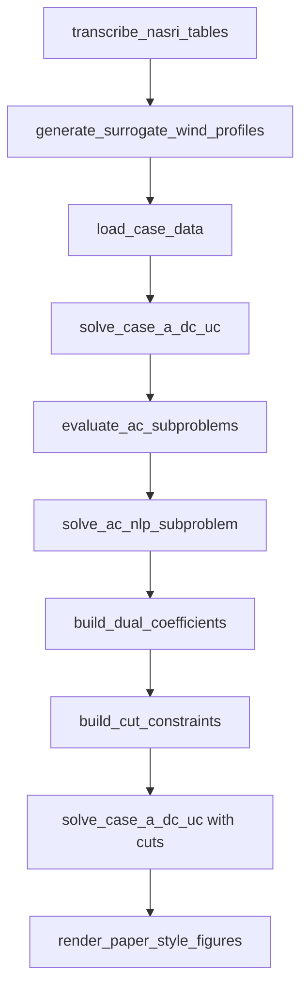

# 小组展示详细版：LLM 辅助的 Nasri 2016 AC-UC Benders 论文复现

## 0. 展示定位

这次展示的核心不是“我们完全复现了论文所有数值”，而是展示一套可复用的 AI 论文复现工具链：

- 用大模型对话完成论文筛选、可复现性判断、模型结构抽取和代码框架设计；
- 用本地脚本完成数据转换、模型求解、Benders 迭代、结果出图和 Obsidian 归档；
- 对无法完整获得的数据和无法完全复现的算法环节，明确标注 proxy、synthetic、partial reproduction，而不是过度宣称。



---

## 1. 如何从论文中提取信息并判断可复现潜力

### 1.1 提取了哪些原文信息

原文第 8-10 页是本次复现的关键证据来源。

![[assets/page_08.pdf.png]]

![[assets/page_09.pdf.png]]

![[assets/page_10.pdf.png]]

从这些页面中提取出的关键复现锚点如下：

| 原文信息 | 提取结果 | 对复现的作用 |
| --- | --- | --- |
| 基础系统 | IEEE one-area 24-node RTS | 确定基础算例 |
| 时间尺度 | 24 小时 | 确定 UC 时段 |
| 功率基准 | 1 p.u. = 100 MW | 所有表格要转换为 MW/Mvar |
| 风电场 | 节点 3 和 14，容量 2.85 p.u. 与 2.96 p.u. | 确定不确定性注入位置 |
| 场景数量 | 40 个风电场景 | 确定随机规划维度 |
| 场景概率 | Table IV | 构建期望目标 |
| 负荷 | RTS 基础负荷乘以 Table III 负荷因子 | 构建 24 小时负荷曲线 |
| Case A | dc-UC | 作为基线模型 |
| Case B | ac-UC, voltage [0.9, 1.1] | 论文主要 Benders 结果 |
| Case C | ac-UC, voltage [0.5, 1.5] | 电压约束松弛对照 |
| 求解器 | GAMS + CPLEX / GAMS + CONOPT | 确定原文求解栈 |
| 收敛条件 | 0.3% expected cost tolerance, 25 iterations | Fig. 5 对齐目标 |

### 1.2 可复现性判定逻辑

判定不是只问“有没有论文 PDF”，而是按下面四类检查：



| 检查项 | Nasri 2016 的情况 | 判定 |
| --- | --- | --- |
| 数据来源 | RTS 系统、Table I-IV 有部分可见信息 | 近似复现可行 |
| 风电场景 | Fig. 3 只有图，没有原始时序表 | 精确复现受阻 |
| 算法结构 | Benders 主问题 + AC NLP 子问题描述明确 | 框架可复现 |
| 割平面细节 | 非凸 AC 子问题的对偶和 cut 全局有效性不完全明确 | 精确算法复现困难 |
| 结果锚点 | Table VI、Fig. 4、Fig. 5 给了目标 | 可做结果对比 |

最后得到的结论是：

> 适合做“近似复现和工具链展示”，但暂时不能声称完整数值复现。

---

## 2. 数据如何获取、转换和补齐

### 2.1 数据来源分层



| 数据类型 | 获取方式 | 转换脚本 | 结果 |
| --- | --- | --- | --- |
| 网络线路容量 | 原文 Table I 转录 | `transcribe_nasri_tables.py` | 覆盖部分线路容量 |
| 机组参数 | 原文 Table II 转录 | `transcribe_nasri_tables.py` | 生成机组上下限、成本、备用能力 |
| 负荷因子 | 原文 Table III 转录 | `transcribe_nasri_tables.py` | 生成 24 小时负荷因子 |
| 场景概率 | 原文 Table IV 转录 | `transcribe_nasri_tables.py` | 生成 40 个场景概率，概率和为 1 |
| RTS 基础负荷 | MATPOWER `case24_ieee_rts.m` | `transcribe_nasri_tables.py` | Pd/Qd 乘以负荷因子 |
| 风电时序 | 原文 Fig. 3 无机器可读数据 | `generate_surrogate_wind_profiles.py` | 生成 40 场景 x 24 小时 x 2 风场 |

### 2.2 表格数据转录脚本做了什么

核心逻辑可以概括成：

```python
def transcribe_tables(data_dir):
    apply_table_i_line_limits(data_dir)
    write_table_ii_generators(data_dir)
    write_load_factors(data_dir)
    write_scenario_probabilities(data_dir)
    write_load_profile_from_matpower(data_dir)
```

这一步把论文里的文字和表格变成了模型可读的 CSV：

- Table I: 线路容量从 p.u. 转换到 MW；
- Table II: 机组 P/Q 上下限、爬坡、备用、成本按 100 MVA 基准转换；
- Table III: 24 小时负荷因子写成逐小时表；
- Table IV: 40 个场景概率写成场景权重；
- MATPOWER RTS: 提供每个节点的基础 Pd/Qd，再按 Table III 缩放。

### 2.3 无法获取的数据如何合理补齐

最大缺失是 Fig. 3 风电场景的原始时序。原文只有图，没有给 40 条曲线的具体数值。

本复现采用 documented synthetic substitute：

```python
TARGET_CAPACITY_FACTOR = 0.2960
SEED = 2016
SOURCE_LABEL = "SYNTHETIC_CALIBRATED_TO_NASRI_2016"
```

补齐原则：

1. 风电场数量、节点和容量严格跟原文一致。
2. 场景数量和概率严格跟原文 Table IV 一致。
3. 总体期望风电出力校准到原文提到的 29.60%。
4. 使用固定随机种子，保证结果可重复。
5. 明确标注不是从 Fig. 3 精确 digitize 得到。

生成结果：

```csv
scenario_id,probability,scenario_total_mwh,scenario_average_mw,scenario_capacity_factor
1,0.01,3597.64,149.90,0.2580
2,0.01,4395.36,183.14,0.3152
...
40,0.04,4615.85,192.33,0.3310
```

这就是展示时要说清楚的边界：

> 我们复现的是论文算例结构和算法流程，不是原始历史风电数据的逐点复制。

---

## 3. 如何参照公式进行建模

### 3.1 对应原文的两阶段结构

论文的两阶段结构可以理解为：


### 3.2 当前 master 模型

当前 master 使用 DC-UC 近似，目标函数包含：

- startup cost；
- expected dispatch cost；
- expected load shedding cost；
- Benders eta approximation cost。

代码中主问题入口是：

```python
solve_case_a_dc_uc(case, solver_config, dry_run=False, out_dir=master_dir)
```

主问题会输出：

- commitment；
- dispatch；
- wind usage；
- bus angles；
- load shedding；
- objective breakdown。

### 3.3 当前 AC 子问题

AC 子问题已经从早期“罚函数求近似可行点”推进到显式约束 Ipopt NLP。变量包括：

| 变量 | 作用 |
| --- | --- |
| voltage magnitude | 节点电压幅值 |
| voltage angle | 节点电压相角 |
| reactive generation | 机组无功出力 |
| active generation recourse | 二阶段有功调整后的出力 |
| wind recourse | 二阶段风电使用 |
| reserve up/down | 上/下备用调整 |
| load shedding | 负荷削减 |
| wind spillage | 弃风 |

关键耦合约束：

```text
Pg_ac[g] - Pg_master[g] - reserve_up[g] + reserve_down[g] = 0
Wind_ac[w] + wind_spill[w] - Wind_master[w] = 0
```

Benders optimality cut 使用这些耦合等式的乘子构造：

```text
eta_s_t >= phi_s_t(x_bar) + sum_i beta_i * (x_i - xbar_i)
```

其中 `beta_i` 来自 Ipopt 返回的局部 KKT 乘子。

### 3.4 与原文公式的差距

| 原文要求 | 当前实现状态 | 说明 |
| --- | --- | --- |
| 主问题 MILP | 已有 DC-UC master | 不是 GAMS/CPLEX，而是 Python/HiGHS 风格实现 |
| 每个场景每个时段一个 AC NLP 子问题 | 部分实现 | 当前真实运行只求解 selected scenario-hours |
| CONOPT 子问题 | 替换为 cyipopt/Ipopt | 可开源复现，但与原文求解器不同 |
| 完整 AC 潮流表达 | 部分实现 | 当前 AC branch 使用简化/lossless 形式 |
| 多起点处理非凸 NLP | 已有 multi-start | 包含 dc_seed、flat_start、flat_start_high_v |
| Benders cut | 已有局部 multiplier-based optimality cut | 不是全局有效凸 cut |

---

## 4. Benders 自动循环如何工作

真实代码流程如下：



### 4.1 论文算法步骤与代码模块对应

论文中的 Benders 思路可以概括为：

1. 给定初始 commitment / dispatch；
2. 求解 MILP master；
3. 对每个场景和时段求解 AC NLP subproblem；
4. 根据子问题对偶信息生成 Benders cut；
5. 将 cut 加回 master；
6. 更新上下界和 gap；
7. 若 gap 小于 0.3%，停止，否则继续迭代。

当前代码实现的对应关系如下：

| 论文算法步骤 | 当前代码模块 | 代码函数 | 当前实现状态 |
| --- | --- | --- | --- |
| 读取系统、机组、负荷、风电、场景概率 | 数据层 | `load_case_data` | 已实现 |
| 求解 master problem | DC-UC master | `solve_case_a_dc_uc` | 已实现，使用重建 DC-UC master |
| 对当前 master 解进行 AC 检查 | AC screening | `evaluate_ac_subproblems` | 已实现，可筛查场景-时段 |
| 选择需要进入 NLP 的子问题 | 子问题选择 | `select_subproblems` | 已实现，当前选择最紧张的若干个 |
| 求解 AC NLP subproblem | AC recourse NLP | `solve_ac_nlp_subproblem` | 已实现，使用 cyipopt/Ipopt 和 multi-start |
| 提取固定 master 变量的乘子 | dual extraction | `build_dual_coefficients` | 已实现，来自显式耦合等式 |
| 生成 Benders optimality cut | cut builder | `build_cut_constraints` | 已实现，生成 cut header 和 cut terms |
| 将 cut 加回 master | master cut reader | `_add_benders_cut_constraints` | 已实现，master 下一轮读取 CSV cuts |
| 计算上下界和 gap | loop logger | `run_benders_auto_loop.main` | 已实现，但 upper bound 是 partial proxy |
| 判断收敛 | stopping rule | `relative_gap_percent <= tolerance` | 已实现，但当前不代表论文全量收敛 |

### 4.2 Benders 循环的核心代码结构

主循环入口在 `run_benders_auto_loop.py`。展示时可以用下面的简化代码说明算法闭环：

```python
for iteration in range(1, max_iterations + 1):
    # 1. 如果已有 cuts，则写入 cumulative_cuts，让 master 读取
    if not cumulative_headers.empty:
        cut_config["benders_cut_constraints"] = str(headers_path)
        cut_config["benders_cut_terms"] = str(terms_path)

    # 2. 求解 master problem
    master = solve_case_a_dc_uc(case, cut_config, dry_run=False, out_dir=master_dir)

    # 3. 对当前 master 解做 AC 子问题筛查
    screening = evaluate_ac_subproblems(
        case,
        case_id=case_id,
        master_results_dir=master_dir,
        out_dir=iteration_dir / "ac_screening",
    )

    # 4. 选择最紧张的 scenario-hour
    selected = select_subproblems(screening_summary, cuts_per_iteration)

    # 5. 对 selected 子问题求解显式 AC NLP
    for item in selected.itertuples(index=False):
        nlp = solve_ac_nlp_subproblem(
            case,
            master_results_dir=master_dir,
            scenario_id=int(item.scenario_id),
            hour=int(item.hour),
            solver_config=solver_config,
        )

    # 6. 提取乘子，生成 optimality cuts
    coeffs = build_dual_coefficients(case.data_dir, successful_batch)
    headers, terms = build_cut_constraints(
        coeffs, dispatch, wind, summaries,
        cut_type="optimality_cut",
        probabilities=probabilities,
    )

    # 7. 更新 cumulative cuts，并计算 gap
    cumulative_headers = concat(cumulative_headers, headers)
    gap = 100 * max(0, upper_bound - lower_bound) / upper_bound
```

### 4.3 代码中的 cut 形式如何对应论文

当前生成的 cut 是局部 optimality cut，形式为：

```text
eta_s_t >= phi_s_t(x_bar) + sum_i beta_i * (x_i - xbar_i)
```

代码中对应两类 cut 数据：

| cut 信息 | 作用 |
| --- | --- |
| cut header | 记录 cut id、场景、时段、eta 变量、概率权重、phi 值 |
| cut terms | 记录每个 master 变量的 beta 系数和 xbar |

master 下一轮读取 cut 时，会创建 eta 变量并加入线性约束：

```python
eta_var = model.addVariable(
    lb=0.0,
    ub=benders_eta_upper_bound,
    obj=eta_objective_weight,
    name=eta_name,
)
```

这里 `eta_objective_weight` 来自场景概率，因此对应论文中的多场景 expected objective 思想：

```text
min first_stage_cost + sum_s probability_s * eta_s
```

### 4.4 与论文完整 Benders 的差距

这段代码适合展示“Benders 闭环已经搭起来”，但还不能说完全复现原文算法。

| 论文完整算法 | 当前实现 |
| --- | --- |
| 每轮求解 40 x 24 个 AC NLP 子问题 | 当前真实求解 selected scenario-hours |
| GAMS + CONOPT 子问题 | 当前使用 cyipopt/Ipopt |
| 非凸 AC 子问题通过多场景期望与 multi-start 缓解 | 当前只有 selected NLP multi-start |
| 完整 ramping temporal heuristic | 尚未完整实现 |
| Fig. 5 真实上下界曲线 | 当前 Fig. 5 是 paper-aligned proxy |

因此展示时建议用这句话：

> 当前代码已经实现了 master-subproblem-cut-master 的 Benders 闭环，但为了控制计算量，子问题只对高风险场景-时段求解；完整论文级复现还需要扩展到每轮 40 x 24 个 AC NLP 子问题。

### 4.5 为什么没有直接跑完整 40 x 24 x 多轮

完整论文设置下，每轮需要：

```text
40 scenarios x 24 hours = 960 AC NLP subproblems per Benders iteration
```

如果按 Fig. 5 的 25 轮，则理论上是：

```text
960 x 25 = 24000 NLP solves
```

当前阶段为保证工具链可运行，采用 selected scenario-hour 模式：

- 每轮先做 AC screening；
- 从 960 个候选中挑最紧张的若干个；
- 当前 full-recourse multi-start 验证中，真实求解了 3 个 selected AC NLP；
- 这能展示算法闭环，但不是原文全量计算。

---

## 5. 复现局限性必须明确说明

### 5.1 ramping 启发式是否实现

原文 Section III-B 对 ramping 做了时间分解启发式处理：放松全局 inter-temporal ramping，再按时段局部处理，以降低计算量。

当前实现状态：

- DC-UC 中有部分机组参数和输出约束；
- 但没有完整复现原文的 ramping temporal decomposition heuristic；
- 当前报告中应表述为“ramping chronology and paper-specific temporal heuristic are incomplete”。

展示时建议这样说：

> 我们搭出了 Benders 主流程，但原文关于 ramping 的启发式时间分解尚未完全实现，这是后续精确复现的重要差距。

### 5.2 是否根据多场景进行 convexified

原文对非凸 AC-UC 的一个解释是：使用大量风电场景后，期望目标在数值上可能表现得更平滑，有利于 Benders 迭代。

当前实现状态：

- 数据层有 40 个场景；
- master 目标已加入 scenario-probability weighting；
- 但真实 Benders NLP 循环没有完整覆盖每轮 40 x 24 子问题；
- 因此不能声称已经实现原文意义上的 multi-scenario convexification。

更准确的表述：

> 当前实现了“期望目标加权结构”，但尚未通过完整多场景 AC NLP 批量求解来验证 convexified 效应。

### 5.3 子问题是否用了完整 NLP 模型

当前 AC 子问题已经是显式约束 NLP，不再是简单罚函数。但仍不是原文完整 CONOPT/GAMS 模型。

已经实现：

- 电压幅值与相角；
- 无功出力；
- 负荷削减；
- 弃风；
- 上下备用调整；
- 固定 master 变量的耦合等式；
- Ipopt multi-start；
- 约束值、解、乘子导出。

仍有差距：

- AC 潮流表达是简化/lossless 版本；
- 不是 GAMS/CONOPT；
- 子问题乘子是局部 NLP 乘子；
- 非凸问题下 cut 不保证全局有效。

### 5.4 复现结果用了多少个场景

需要区分“数据层”和“求解层”：

| 层次 | 使用情况 |
| --- | --- |
| 风电数据 | 40 个场景，24 小时，2 个风场 |
| Case A DC 基线 | 使用 40 个场景的期望结构 |
| AC screening | 可覆盖 40 x 24 的候选检查 |
| AC NLP true solve | 当前阶段只求解 selected scenario-hours，典型验证为 3 个子问题 |
| Fig. 5 展示曲线 | 40-scenario expected objective proxy，不是全量 NLP 真实收敛曲线 |

### 5.5 为什么 Fig. 5 的 gap 如此平滑

这是展示时非常容易被问到的问题。

答案是：

> Fig. 5 当前是 paper-aligned proxy curve，用来展示论文 Fig. 5 的算法形态。它锚定原文 Case B cost、25 次迭代和 0.3% 容差，因此曲线是平滑下降的。它不是从 25 轮完整 40 x 24 AC NLP Benders 求解日志直接画出的原始 gap。

所以它适合用于：

- 解释论文中 Benders 上下界逐步靠近的思想；
- 展示目标复现形态；
- 做汇报可视化。

不适合用于：

- 宣称已经数值复现论文 Fig. 5；
- 证明当前 cuts 已经在完整非凸 AC-UC 上收敛。

---

## 6. Fig. 4 如何与复现结果进行对比

原文 Fig. 4 是 Case A/B/C 的机组 commitment status。它强调：

- Case A 和 Case B 的机组启停不同；
- 原文提到 units 22 和 23 在 Case A 中停机，在 Case B 峰时开机；
- unit 9 在 Case B 的前两个时段开机；
- 电压约束会改变机组组合。

当前复现 Fig. 4 是 paper-style operational summary：

![[assets/fig4_generation_schedule.png]]

它展示的是：

- expected thermal generation；
- wind used；
- wind curtailed；
- committed units count。

所以 Fig. 4 对比要分两层讲：

| 对比层次 | 是否已做到 | 说明 |
| --- | --- | --- |
| 展示“调度随时间变化” | 已做到 | 当前 Fig. 4 能显示热电、风电和开机数变化 |
| 完全复刻原文 32 台机组 x 24 小时 commitment heatmap | 未完全做到 | 需要生成 Case A/B/C 三组 commitment matrix 对比 |
| 对齐原文关于 unit 22/23/9/32 的逐机组结论 | 部分做到 | 当前有 commitment CSV，但 Case B/C 仍未由完整 AC-Benders 求得 |

汇报时建议表述：

> 当前 Fig. 4 是“论文风格的调度摘要图”，用于展示复现管线已能产出对应类型结果；但它还不是原文 Fig. 4 的逐机组启停图，完整对比需要后续用全量 Case B/C AC-Benders 结果生成 commitment heatmap。

---

## 7. 复现工具链中每个关键函数如何调用

### 7.1 总入口



| 函数 | 输入 | 输出 | 后续如何使用 |
| --- | --- | --- | --- |
| `load_target` | target YAML | 论文元数据和 run_dir | 切换论文时只改 YAML |
| `init_target` | target dict | 初始化运行目录和 PDF | 每篇论文第一步 |
| `cmd_extract_pdf` | PDF | paper_text.json 和 evidence snippets | 给 LLM 审计和模型抽取使用 |
| `cmd_audit` | paper_text + schema | 可复现性审计 JSON/MD | 判断是否值得复现 |
| `cmd_model_spec` | paper_text + schema | 变量、参数、约束、目标 | 生成建模说明 |
| `cmd_traces` | target | algorithm/source trace | 建立论文到代码的桥 |
| `cmd_scaffold_repro` | target | 数据模板、配置、代码骨架 | 进入实现阶段 |
| `cmd_validate_data` | data templates | 数据完整性报告 | 检查缺失项 |
| `cmd_write_obsidian` | 所有产物 | Obsidian vault | 小组协作和展示 |

### 7.2 LLM API 接口调用方式

LLM 客户端不是开放式聊天，而是 schema-constrained JSON 调用：

```python
call_openai_json(prompt=prompt, schema=schema, schema_name="audit")
```

内部调用逻辑：

```python
payload = {
    "model": model,
    "input": [
        {"role": "system", "content": "Return schema-valid JSON only."},
        {"role": "user", "content": prompt},
    ],
    "text": {"format": {"type": "json_schema", "schema": schema, "strict": True}},
}
```

接口来源：

- 优先读环境变量 `OPENAI_API_KEY`、`OPENAI_BASE_URL`、`OPENAI_MODEL`；
- 如果没有，则读取 Codex app 的 `~/.codex/config.toml` 和 `~/.codex/auth.json`。

这样后续可以复用为：

```bash
python3 -m tools.repro_cli audit --target config/targets/new_paper.yaml
python3 -m tools.repro_cli model-spec --target config/targets/new_paper.yaml
```

### 7.3 Nasri 复现阶段函数链



| 函数 | 作用 | 关键接口 |
| --- | --- | --- |
| `transcribe_tables` | 转录 Table I-IV | 输入 data_dir，输出线路、机组、负荷、概率表 |
| `generate_surrogate` | 补齐 Fig. 3 风电场景 | 输入 wind_farms 与 scenario_probabilities |
| `load_case_data` | 读取所有 CSV | 返回 CaseData |
| `solve_case_a_dc_uc` | 求解 DC-UC master | 输入 CaseData 和 solver_config |
| `evaluate_ac_subproblems` | 对所有候选场景时段做 AC 筛查 | 输出 violation summary |
| `select_subproblems` | 选择最紧张的子问题 | 默认选若干 worst cases |
| `solve_ac_nlp_subproblem` | 求解显式 AC NLP | 输出 solution、constraints、multipliers |
| `build_dual_coefficients` | 从 multipliers 生成 beta | 用于 optimality cut |
| `build_cut_constraints` | 生成 cut headers 和 terms | 供 master 下一轮读取 |
| `render_paper_style_figures` | 生成 Fig. 3/4/5 与对比图 | 输出 PNG/SVG |

### 7.4 后续如何使用这套工具链

如果换一篇新的电力系统论文，推荐流程是：

```bash
python3 -m tools.repro_cli init-target --target config/targets/new_paper.yaml
python3 -m tools.repro_cli extract-pdf --target config/targets/new_paper.yaml
python3 -m tools.repro_cli audit --target config/targets/new_paper.yaml
python3 -m tools.repro_cli model-spec --target config/targets/new_paper.yaml
python3 -m tools.repro_cli prepare-repro --target config/targets/new_paper.yaml
python3 -m tools.repro_cli write-obsidian --target config/targets/new_paper.yaml
```

然后按论文类型替换：

- 数据转录脚本；
- baseline solver；
- subproblem solver；
- 图表渲染脚本；
- 结果对比模板。

---

## 8. 本次复现的阶段性结果

### Fig. 3: 40 场景风电输入

![[assets/fig3_wind_scenarios.png]]

这张图说明：

- 40 个场景和 24 小时结构已建立；
- 两个风场对应原文节点 3 和 14；
- 但时序是 synthetic calibrated data，不是原始历史数据。

### Fig. 4: 调度摘要

![[assets/fig4_generation_schedule.png]]

这张图说明：

- 当前 pipeline 能生成调度类结果；
- 可以观察热电、风电、弃风、开机数量；
- 但还不是原文逐机组 Case A/B/C commitment heatmap。

### Fig. 5: Benders 收敛形态

![[assets/fig5_benders_convergence.png]]

这张图说明：

- 展示 Benders 上下界逐步靠近；
- 显示 0.3% 容差线；
- 是 paper-aligned proxy，不是完整真实迭代日志。

### 原文与复现对比

![[assets/paper_vs_reproduction_comparison.png]]

这张图适合放在结尾，因为它把“做到了什么”和“还差什么”说清楚。

---

## 9. 展示时可直接使用的结论

1. 数据层面：RTS、机组表、负荷因子、场景概率均已结构化；风电轨迹由于原文未公开，只能用校准合成数据。
2. 模型层面：已搭建 DC-UC master、AC NLP subproblem、局部乘子 optimality cut 和自动 Benders loop。
3. 结果层面：已生成 Fig. 3/4/5 风格图和原文对比图，但 Case B/C 尚未完成原文级全量 AC-Benders 复现。
4. 局限性：ramping 启发式、多场景 convexification、完整 CONOPT/GAMS 子问题、全量 40 x 24 x 25 迭代仍是后续工作。
5. 工具链价值：只通过对话推动任务，但实际产物是可检查、可运行、可复用的本地脚本和数据。
