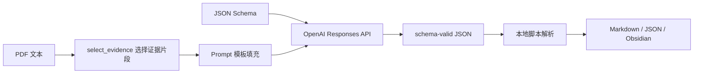
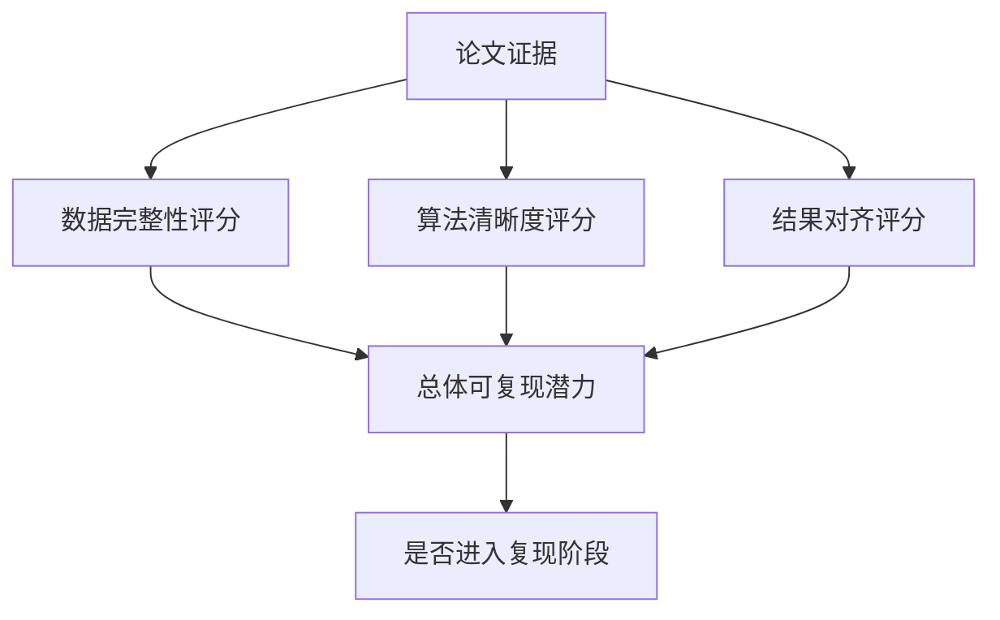
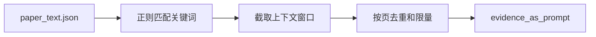
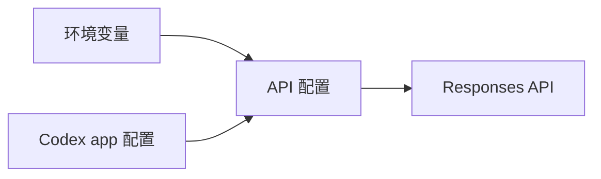
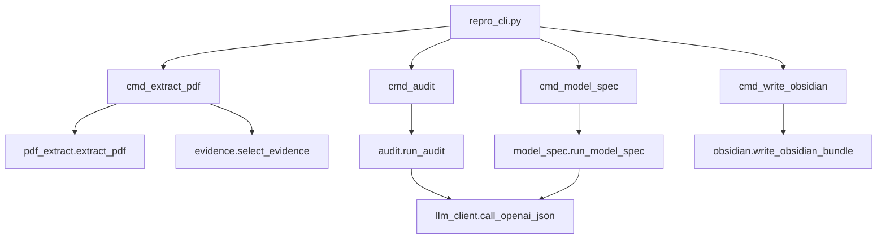

# Stage 18：大模型接口对话设计与文件结构说明

## 1. 总体设计：不是开放式聊天，而是结构化接口调用

这套工具链里，大模型接口调用被设计成“固定任务 + 证据输入 + JSON Schema 输出”的形式。也就是说，每次不是让模型自由发挥，而是把它限制在一个清楚的接口协议内：



当前真正调用大模型的任务主要有两类：

| 调用类型 | 目标 | 输入 | 输出 |
| --- | --- | --- | --- |
| `audit` | 判断论文可复现潜力 | 论文元数据 + 证据片段 + audit prompt + audit schema | 可复现性审计 JSON |
| `model-spec` | 抽取实现导向的模型结构 | 论文元数据 + 证据片段 + model-spec prompt + model-spec schema | sets/parameters/variables/objective/constraints JSON |

其他步骤，如 PDF 抽取、数据模板生成、Obsidian 写入、图表绘制、Benders 求解，都是本地脚本完成，不依赖大模型直接操作。

---

## 2. 每次与大模型“对话”的格式

### 2.1 系统消息

每次调用都会先给模型一个系统约束：

```text
You are a precise research reproducibility auditor. Return schema-valid JSON only.
```

它的作用是：

- 限定模型角色；
- 要求只返回 JSON；
- 避免返回解释性散文；
- 便于后续由本地脚本直接解析。

### 2.2 用户消息

用户消息不是普通自然语言，而是由模板生成。模板里有两个占位符：

```text
Paper metadata:
{{metadata}}

Extracted evidence:
{{evidence}}
```

其中：

- `metadata` 来自 target YAML；
- `evidence` 来自 PDF 文本中筛选出的相关片段；
- prompt 模板根据任务不同分为 audit 和 model-spec。

---

## 3. 第一次对话：可复现性审计 audit

### 3.1 Prompt 设计

`audit` 调用要求模型回答：

- 数据源是否足够明确；
- 变量、目标、约束、单位、随机集是否清楚；
- 主问题、子问题、割平面、收敛、求解器是否清楚；
- 结果是否能用表格或图进行对齐；
- 哪些因素阻碍精确复现。

简化后的 prompt 结构如下：

```text
You are auditing a power-system optimization paper before implementation.

Return only JSON matching the provided schema.

Evaluate:
- whether data sources are explicit enough to rebuild the test system;
- whether model variables, objective, constraints, units, and uncertainty sets are clear;
- whether algorithm steps such as master problem, subproblem, cuts, convergence, tolerances, and solver settings are clear;
- whether reported results can be aligned by tables, figures, or metrics;
- what blocks exact reproduction.

Use conservative scores from 0 to 5.

Paper metadata:
...

Extracted evidence:
...
```

### 3.2 返回 JSON 的结构

模型必须按 schema 返回：

```json
{
  "paper_title": "...",
  "recommended_role": "primary_target | method_reference | sanity_check | reject",
  "scores": {
    "data": 0,
    "algorithm": 0,
    "result_alignment": 0,
    "overall": 0
  },
  "data_check": [],
  "algorithm_check": [],
  "result_alignment": [],
  "blockers": [],
  "next_steps": []
}
```

### 3.3 这一步产出的价值

它把“这篇论文值不值得复现”变成了一个可比较的结构化判断：



对 Nasri 2016 来说，这一步识别出：

- RTS 系统、场景数量、风电容量、Table VI 等是强锚点；
- Fig. 3 风电原始时序缺失；
- Benders cut 和非凸 AC NLP 乘子处理是主要风险；
- 因此适合近似复现和工具链展示，不适合直接宣称精确复现。

---

## 4. 第二次对话：模型结构抽取 model-spec

### 4.1 Prompt 设计

`model-spec` 不是让模型写代码，而是让它抽取“实现导向”的模型规范：

```text
Extract an implementation-oriented model specification from the paper evidence.

Return only JSON matching the provided schema. Keep each entry concise and implementation-ready.

Paper metadata:
...

Extracted evidence:
...
```

### 4.2 返回 JSON 的结构

模型必须按 schema 返回：

```json
{
  "sets": [],
  "parameters": [],
  "variables": [],
  "objective": "...",
  "constraints": [],
  "uncertainty": [],
  "implementation_notes": []
}
```

### 4.3 这一步产出的价值

它把论文中的数学描述转成实现清单：

| 抽取项 | 对代码的作用 |
| --- | --- |
| sets | 决定索引维度，如 buses/generators/scenarios/hours |
| parameters | 决定数据表字段 |
| variables | 决定 master/subproblem 的变量 |
| objective | 决定求解器目标函数 |
| constraints | 决定模型约束模块 |
| uncertainty | 决定场景或不确定集处理方式 |
| implementation_notes | 决定先做什么、后做什么 |

---

## 5. 本地脚本如何构造对话输入

### 5.1 证据片段筛选

大模型不是读取整篇论文全文，而是读取被筛选后的证据片段。证据选择函数会搜索以下关键词：

```text
test system, generator, wind, load, uncertainty,
master problem, subproblem, benders, solver,
computational, table, appendix
```

处理流程：



这样做有两个好处：

1. 控制 token 数量；
2. 让模型只看与复现相关的信息。

### 5.2 Prompt 模板填充

本地函数会把模板中的占位符替换掉：

```python
prompt = render_prompt(
    prompt_path,
    metadata=metadata,
    evidence=evidence_as_prompt(snippets)
)
```

### 5.3 API 调用

最终请求被组装成：

```python
payload = {
    "model": model,
    "input": [
        {
            "role": "system",
            "content": "You are a precise research reproducibility auditor. Return schema-valid JSON only.",
        },
        {"role": "user", "content": prompt},
    ],
    "text": {
        "format": {
            "type": "json_schema",
            "name": schema_name,
            "strict": True,
            "schema": schema,
        }
    },
}
```

### 5.4 认证和模型配置

接口配置有两层来源：



优先级：

1. `OPENAI_API_KEY`
2. `OPENAI_MODEL`
3. `OPENAI_BASE_URL`
4. 如果环境变量没有，则读取 `~/.codex/config.toml` 和 `~/.codex/auth.json`

---

## 6. 文件结构展示

下面是这个工具链与大模型接口相关的核心文件结构：

```text
paper-reconstruct/
├── README.md
├── config/
│   ├── prompts/
│   │   ├── reproducibility_audit.md
│   │   └── model_spec.md
│   ├── schemas/
│   │   ├── reproducibility_audit.schema.json
│   │   └── model_spec.schema.json
│   └── targets/
│       ├── nasri_2016_ac_uc_benders.yaml
│       ├── lee_2014.yaml
│       ├── gourtani_2016.yaml
│       └── bertsimas_2013.yaml
├── tools/
│   ├── repro_cli.py
│   ├── llm_client.py
│   ├── pdf_extract.py
│   ├── evidence.py
│   ├── audit.py
│   ├── model_spec.py
│   ├── repro_scaffold.py
│   ├── obsidian.py
│   ├── traces.py
│   └── matpower_import.py
└── runs/
    └── nasri_2016_ac_uc_benders/
        ├── extracted_text/
        │   ├── paper_text.json
        │   └── evidence_snippets.json
        ├── audits/
        │   ├── reproducibility_audit.json
        │   └── reproducibility_audit.md
        ├── artifacts/
        │   ├── model_spec.json
        │   ├── model_spec.md
        │   ├── figures_tables_manifest.json
        │   └── equations_manifest.json
        ├── data/
        ├── src/
        ├── results/
        ├── reports/
        └── obsidian/
```

---

## 7. 文件之间如何调用

### 7.1 CLI 调用链



### 7.2 audit 调用链

```text
repro_cli.py
└── cmd_audit()
    └── audit.run_audit()
        ├── evidence.select_evidence()
        ├── llm_client.render_prompt()
        └── llm_client.call_openai_json()
            ├── load_codex_api_config()
            ├── POST /responses
            └── extract_response_text()
```

### 7.3 model-spec 调用链

```text
repro_cli.py
└── cmd_model_spec()
    └── model_spec.run_model_spec()
        ├── evidence.select_evidence()
        ├── llm_client.render_prompt()
        └── llm_client.call_openai_json()
            ├── load_codex_api_config()
            ├── POST /responses
            └── extract_response_text()
```

---

## 8. 一次完整运行中会发生哪些“大模型对话”

如果运行：

```bash
python3 -m tools.repro_cli run-all --target config/targets/nasri_2016_ac_uc_benders.yaml
```

且不加 `--offline`，会发生两次大模型接口调用：

| 顺序 | 命令阶段 | 调用内容 | 返回结果 |
| --- | --- | --- | --- |
| 1 | `cmd_audit` | 论文可复现性审计 prompt | `reproducibility_audit.json` |
| 2 | `cmd_model_spec` | 模型结构抽取 prompt | `model_spec.json` |

如果加上：

```bash
--offline
```

则不会调用大模型，而是用本地规则生成一个粗略结果，便于测试流水线。

---

## 9. 为什么这种设计适合小组展示

这套接口设计的亮点是：

1. 不是让大模型直接改所有文件，而是让它在明确 schema 内给出结构化判断。
2. 每次调用都有可追踪的输入：论文元数据、证据片段、prompt 模板、schema。
3. 每次调用都有可验证的输出：JSON 文件可以被脚本解析，也可以转成 Markdown 报告。
4. 后续换论文时，只需要换 target YAML 和 PDF，prompt/schema/CLI 框架可以继续复用。

一句话总结：

> 大模型在这里扮演“结构化审稿人与模型抽取器”，本地脚本才是实际的工程执行器。

