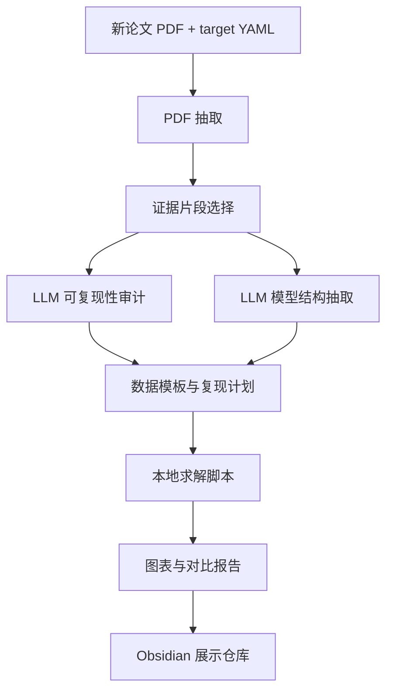

# Stage 19：论文复现工具链的可复用性与展示内容

## 1. 结论：这套工具链具有较强可复用性

这套工具链不是只为 Nasri 2016 写的一次性脚本。它可以复用在其他电力系统优化论文上，尤其适合以下类型：

- unit commitment / economic dispatch；
- stochastic UC / robust UC；
- Benders decomposition；
- column-and-constraint generation；
- AC/DC network-constrained optimization；
- 有标准算例、表格结果、算法流程图的论文。

但是可复用性分两层：

| 层次 | 是否可复用 | 说明 |
| --- | --- | --- |
| 论文筛选、审计、模型抽取 | 高 | prompt、schema、LLM 接口基本不用改 |
| PDF 抽取、证据筛选、Obsidian 归档 | 高 | 与具体论文无关 |
| 数据模板和结果报告结构 | 中高 | 电力系统论文大体可复用 |
| 求解模型和算法细节 | 中等 | 需要按论文重写或扩展 |
| 图表复刻 | 中等 | 每篇论文的图不同，需要定制渲染 |

一句话总结：

> 可复用的是“论文复现流程和工程骨架”，不是每篇论文的全部数学模型。

---

## 2. 可复用模块



### 2.1 论文筛选层

可复用内容：

- `reproducibility_audit` prompt；
- `reproducibility_audit.schema.json`；
- 证据片段筛选逻辑；
- scoring 方式；
- blockers / next steps 输出格式。

展示价值：

- 可以说明我们不是随机挑论文，而是先做可复现性筛查；
- 能比较多篇候选论文，选择最适合复现的目标。

### 2.2 模型抽取层

可复用内容：

- `model_spec` prompt；
- `model_spec.schema.json`；
- sets / parameters / variables / objective / constraints / uncertainty 的统一结构。

展示价值：

- 把论文公式转成实现清单；
- 为后续代码框架提供依据；
- 适合展示“大模型不是写答案，而是帮我们结构化论文信息”。

### 2.3 工程骨架层

可复用内容：

- target YAML；
- run 目录结构；
- data/configs/src/results/reports/obsidian 分层；
- scaffold 脚本；
- data validation；
- Obsidian bundle 输出。

展示价值：

- 换论文时只需要新建 target YAML；
- 所有产物自动进入统一结构；
- 小组协作时很容易追踪。

### 2.4 LLM API 层

可复用内容：

- 统一 `call_openai_json` 接口；
- Codex app API 配置读取；
- JSON schema strict output；
- offline fallback。

展示价值：

- 说明工具链不是依赖人工复制粘贴；
- 每次 LLM 调用都有输入、输出、schema；
- 可以复现实验，也可以离线测试流程。

### 2.5 结果展示层

可复用内容：

- paper-style figure generation 的设计模式；
- 原文结果 vs 复现结果对比表；
- 阶段报告模板；
- Obsidian 展示仓库。

展示价值：

- 每一步都有可视化成果；
- 能清楚说明“完成了什么”和“还差什么”；
- 适合课程展示和小组作业汇报。

---

## 3. 不可直接复用、需要按论文定制的部分

| 部分 | 为什么不能完全复用 | 新论文需要做什么 |
| --- | --- | --- |
| 数据转录脚本 | 每篇论文表格字段不同 | 新写 table transcription |
| 风电/负荷/不确定性数据 | 场景来源和生成方式不同 | 按论文数据重新构造 |
| 优化模型 | 约束和变量不同 | 修改 solver module |
| 分解算法 | Benders、C&CG、ADMM 等不同 | 重写 algorithm loop |
| 图表复刻 | 每篇论文图形结构不同 | 新写 render script |
| 精确结果对齐 | benchmark 和 solver 不同 | 定制 comparison table |

这部分可以在展示中强调：

> 工具链能复用 60%-70% 的流程性工作，但模型和数据仍然需要研究者理解论文后定制。

---

## 4. 如果复现另一篇论文，流程怎么走

### 4.1 创建目标配置

准备一个新的 target YAML：

```yaml
id: new_paper_id
title: Paper Title
authors:
  - Author A
year: 2024
venue: IEEE Transactions on Power Systems
doi: ...
source_pdf: /path/to/paper.pdf
run_dir: runs/new_paper_id
```

### 4.2 运行通用流程

```bash
python3 -m tools.repro_cli init-target --target config/targets/new_paper.yaml
python3 -m tools.repro_cli extract-pdf --target config/targets/new_paper.yaml
python3 -m tools.repro_cli audit --target config/targets/new_paper.yaml
python3 -m tools.repro_cli model-spec --target config/targets/new_paper.yaml
python3 -m tools.repro_cli prepare-repro --target config/targets/new_paper.yaml
python3 -m tools.repro_cli write-obsidian --target config/targets/new_paper.yaml
```

### 4.3 进入定制复现阶段


---

## 5. 展示时可以重点展示什么

### 展示 1：多论文筛选能力

可以展示：

- 不同论文 target YAML；
- 可复现性审计评分；
- data / algorithm / result alignment 三项对比；
- 为什么选择某一篇作为主复现对象。

讲法：

> 工具链先帮助我们判断哪些论文值得复现，避免直接投入大量建模时间。

### 展示 2：LLM 接口不是“黑箱聊天”

可以展示：

- prompt 模板；
- schema；
- JSON 输出；
- markdown report。

讲法：

> 每次大模型调用都有固定输入输出协议，结果可以被脚本解析，不是一次性聊天记录。

### 展示 3：统一文件结构

可以展示：

```text
runs/<paper_id>/
├── extracted_text/
├── audits/
├── artifacts/
├── data/
├── configs/
├── src/
├── results/
├── reports/
└── obsidian/
```

讲法：

> 换论文后仍然进入同样的目录结构，降低小组协作成本。

### 展示 4：从论文到代码的映射

可以展示：

- 原文公式截图；
- model_spec 抽取结果；
- 数据模板；
- solver function skeleton；
- 最终求解输出。

讲法：

> 大模型把论文公式转换成工程清单，本地脚本再把工程清单变成模型和结果。

### 展示 5：结果对齐与局限性

可以展示：

- paper-vs-reproduction comparison；
- 原文 Fig. 3/4/5；
- 复现 Fig. 3/4/5；
- 哪些是真实计算结果，哪些是 proxy。

讲法：

> 工具链不仅生成结果，也帮助我们诚实标注复现边界。

---

## 6. 可以复用到哪些论文类型

| 论文类型 | 复用程度 | 原因 |
| --- | --- | --- |
| DC unit commitment | 高 | 数据结构和 MILP 框架容易复用 |
| stochastic UC | 高 | 场景、概率、期望目标结构相似 |
| robust UC / C&CG | 中高 | master-subproblem-loop 可复用 |
| Benders decomposition | 中高 | cut pool、iteration log、bound trace 可复用 |
| AC optimal power flow | 中等 | NLP 子问题结构可复用，但公式差异大 |
| market clearing / planning | 中等 | 审计和数据模板可复用，模型需定制 |

---

## 7. 可复用性的边界

这套工具链不能自动保证：

- 原文隐藏数据能被恢复；
- 图中曲线能被精确 digitize；
- 非凸优化的全局最优性；
- 与 GAMS/CONOPT/CPLEX 完全一致；
- 所有论文公式都能由 OCR 正确抽取。

因此展示时可以强调：

> 工具链提高的是复现的组织效率、可追踪性和自动化程度；真正的数学建模和结果解释仍然需要人工判断。

---

## 8. 小组展示推荐页面

建议展示顺序：

1. 工具链总流程图。
2. LLM prompt + schema 的接口设计。
3. 新论文 target YAML 示例。
4. 自动生成的可复现性审计。
5. 自动生成的模型结构抽取。
6. 数据模板和补数策略。
7. 求解脚本和函数调用链。
8. 论文风格图表。
9. 原文 vs 复现对比。
10. 可复用性与局限性总结。

---

## 9. 一句话总结

这套工具链的可复用性体现在：

> 它把“读论文、判断可复现性、抽取模型、搭建目录、生成数据模板、记录实验、输出展示材料”变成了一套标准流程；换论文时，通用流程可以复用，论文专属的数据和模型再局部定制。

